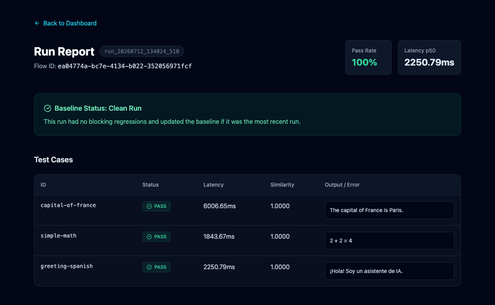

# FlowBench

> Automated testing & benchmarking for Lamatic flows.

## Overview

FlowBench is a pre-merge regression testing tool for Lamatic flows — think of it as **CI for AI agents**. Give it a flow ID and a set of test cases, and it will execute every case, score output quality using local embeddings, measure latency, and compare the results against a saved baseline. This ensures that prompt tweaks or model switches don't quietly break your application's logic or degrade response quality before shipping.

### How it compares to other tools

Unlike the `llm-silent-failure-detector`, which is meant for continuous production monitoring, FlowBench is designed for the pre-deployment lifecycle stage to catch regressions *before* they reach production. And unlike the `live-api-debugger`, which helps you interactively step through a single request, FlowBench runs fully automated batch tests across your entire dataset at once.

## Dashboard



## Architecture

FlowBench is built to be lightweight, developer-friendly, and stateless:
- **No Database or Auth:** Baselines and run histories are saved as flat JSON files in the `.flowbench/` directory.
- **Local Scoring:** Output similarity is scored completely locally using the `Xenova/all-MiniLM-L6-v2` embedding model via `@xenova/transformers`, avoiding extra API costs or third-party dependencies for evaluation.
- **Strict Gating:** The engine automatically filters out natural LLM latency jitter, ensuring that only true correctness regressions (like drops in similarity or new failures) block a baseline update.

## Quick Start

Follow these steps to run FlowBench on a fresh clone. Requires Node 18+.

1. **Clone the repository and install dependencies:**
   ```bash
   git clone https://github.com/Lamatic/AgentKit.git
   cd AgentKit/kits/flowbench/apps
   npm install
   ```

2. **Set up your environment variables:**
   Copy the example environment file:
   ```bash
   cp .env.example .env
   ```
   Open the `.env` file and fill in your Lamatic credentials. You can find these values in the **Lamatic Studio** under your Project Settings:
   - `LAMATIC_API_URL`: Your project's GraphQL endpoint
   - `LAMATIC_API_KEY`: Your project's API key
   - `LAMATIC_PROJECT_ID`: Your specific project ID

3. **Start the Dashboard:**
   ```bash
   npm run dev
   ```
   Open `http://localhost:3000` in your browser. You can select a test file (like `../sample-tests/example.jsonl`), input your Lamatic Flow ID, and run the benchmark!

## Known Limitations

Similarity scoring measures semantic closeness, not just factual correctness — a correct but more verbose or more terse response than the reference string may score lower than expected. For best results, calibrate `expected_contains` reference strings to match your flow's typical response style and verbosity, rather than using minimal keyword-only references.

## Design note

Unlike single-flow kits where the target flow is baked into the configuration at deploy time, FlowBench tests *arbitrary* flows. The `flowId` is intentionally dynamic and user-supplied at runtime — the user enters it in the dashboard form (or passes it via the orchestration API) so they can point the same benchmarking infrastructure at any Lamatic flow without redeploying. This is a deliberate design choice, not an oversight.
